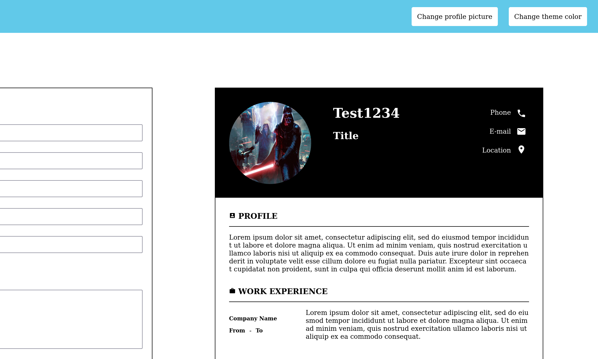

# [TheOdinProject](https://www.theodinproject.com/)

## Project: cv-application



A cv maker built with typescript and React.

Icons used from [React Material Icons](https://material-ui.com/components/material-icons/)

Conversion to image is made possible with [html-to-image](https://www.npmjs.com/package/html-to-image) and [downloadjs](https://www.npmjs.com/package/downloadjs)

Contrast ratio calculated with [get-contrast-ratio](https://www.npmjs.com/package/get-contrast-ratio)

## Features

- Real time update
- Image uploader
- Dynamic color theme
- Download as image

## Installation

Clone the repository:

```bash
git clone https://github.com/Alberinea/cv-application.git
```

Open the project folder:

```bash
cd cv-application
```
Open the project folder:

```bash
cd shopping-cart
```

Install all dependencies:

```bash
npm i
```

Run the app in development mode:

```bash
npm start
```

It should automatically open the App in your browser.

If that is not the case, open [port3000](http://localhost:3000/).

## Demo

[Live Demo](https://alberinea.github.io/cv-application/)

